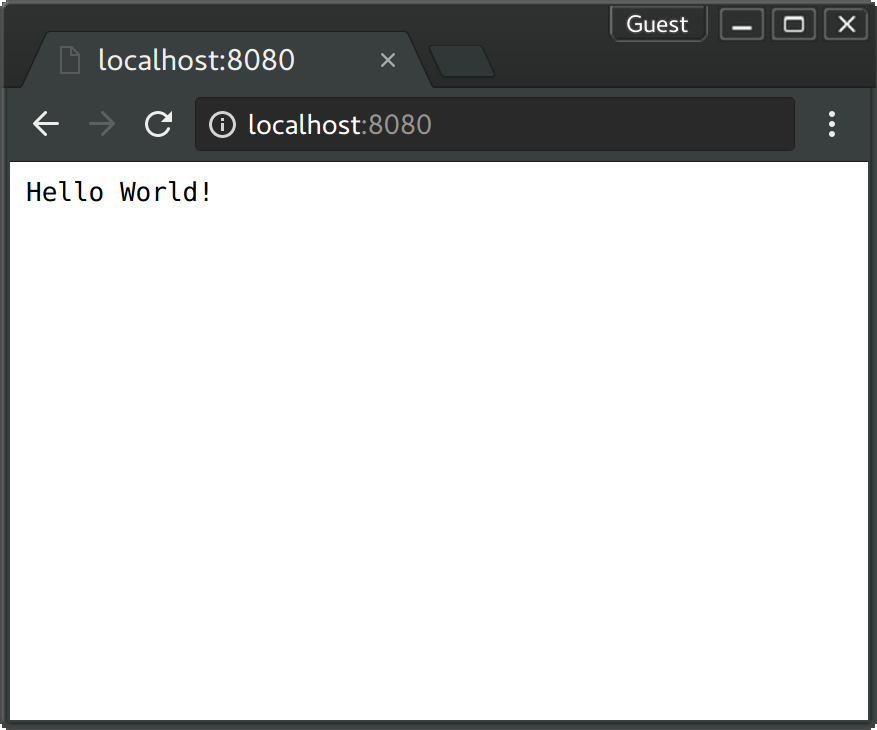

# Docker Tomcat Java 

[![Software License][ico-license]](LICENSE.md)

Ejemplo de como instalar un proyecto en contendores Docker con Tomcat y java con jsf

## Lo que necesitas (Ububntu)

- [Instalar docker en tu pc.][instalar-docker]

- [Instalar docker-compose en tu pc.][instalar-docker-compose]

- [Instalar gradle en tu pc.][instalar-gradle]
  


- Crear el proyecto.

``` bash
$ ./gradlew build
```

- Crear contenedores.

``` bash
$ docker-compose up
```

-Tienes que ver algo parecido.

``` bash
docker-compose up --build
Building tomcat
Step 1/3 : FROM tomcat:alpine
 ---> 877ea9315a49
Step 2/3 : RUN rm -fr /usr/local/tomcat/webapps/ROOT
 ---> Using cache
 ---> eca02f5f3cd9
Step 3/3 : COPY ./build/libs/docker-tomcat-java-example.war /usr/local/tomcat/webapps/ROOT.war
 ---> Using cache
 ---> 00bf21347503
Successfully built 00bf21347503
Successfully tagged dockertomcatjavaexample_tomcat:latest
Starting dockertomcatjavaexample_tomcat_1
Attaching to dockertomcatjavaexample_tomcat_1
tomcat_1  | 17-Jun-2017 14:03:31.578 INFO [main] org.apache.catalina.startup.Catalina.start Server startup in 403 ms
```

- En el navegador ves a `localhost:8080` Tienes que ver la página de bienvenida.



## License

The MIT License (MIT). Please see [License File](LICENSE.md) for more information.

[ico-license]: https://img.shields.io/badge/license-MIT-brightgreen.svg?style=flat-square
[instalar-docker]: https://docs.docker.com/engine/installation
[instalar-docker-compose]: https://docs.docker.com/compose/install
[instalar-gradle]: https://gradle.org/install
